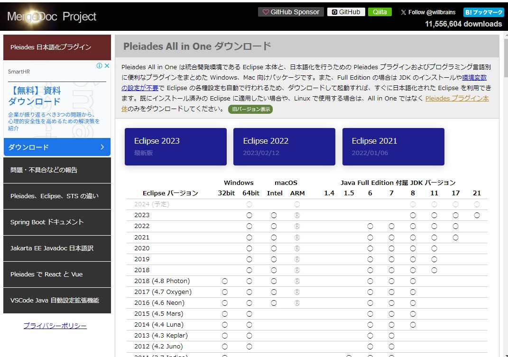
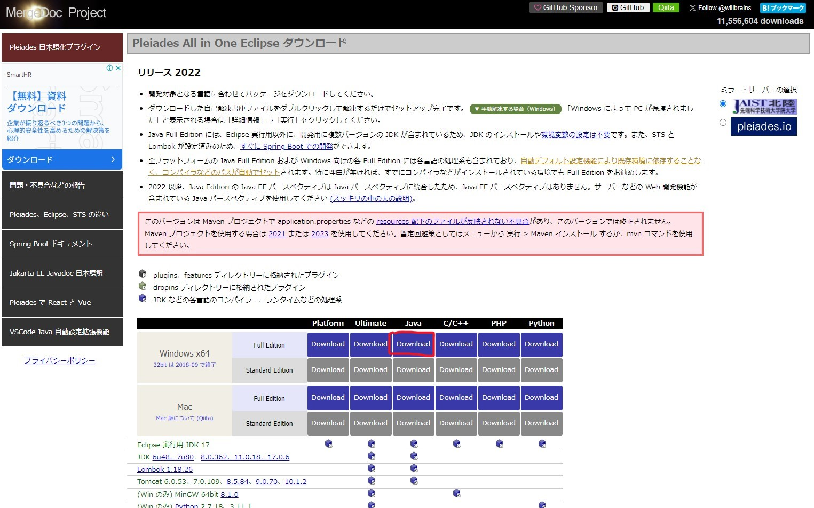
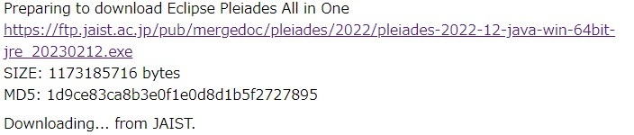
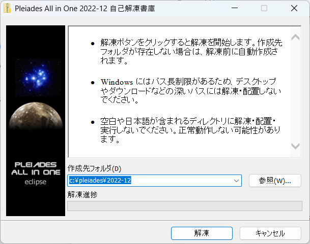

# EclipseIDEのインストール

Eclipse IDE（Integrated Development Environment）は、Javaをはじめとするさまざまなプログラミング言語でのソフトウェア開発を支援する統合開発環境です。Eclipseは、コードの編集、デバッグ、ビルドなどの開発作業を行うためのツールを提供します。また、機能を拡張するためのプラグインも豊富に提供されており、さまざまなプログラミング言語や開発フレームワークに対応しています。

## インストーラーをダウンロード
# EclipseIDE ver.4.26.0
[EclipseIDEダウンロードページ](https://willbrains.jp/)にアクセスし、表示されるインストーラーのバージョンなどを確認し、インストーラーをダウンロードしてください。

おそらくこのようなページが開いているはずです。

青い3つのボタンのうち、Eclipse2022をクリックしてください。

このようなページに遷移します。画像中で赤い丸で囲われているインストーラーをクリックします。

:::warning これらを確認し、クリックしてください。
- Windows x64を選んでいること
- Windows x64でもFull Editionを選んでいること
- Javaを選んでいること
:::

押したらインストールが始まるはずですが、人によってはポップアップブロックを有効にしている人もいると思います。
遷移先のページに、httpsから始まるリンクが置いてあると思うのでそこをクリックするとダウンロードが始まります。
下の画像のようにリンクがあるはずです。

:::info
- Windows x86では動かないかもしれませんが、
まず最近のPCで32bitのCPUを搭載している例は稀ですし、32bitのPCには最近のPCでは考えられないくらい制約が厳しいのでゴッツイゲーミングPCユーザーは気にしなくていいです。
- どうしても気になって夜しか眠れなくなってしまった場合は落ち着いてWindowsキーとXキーを押し、出てくるメニューから設定を選択し、システムを選んで
Windous10では詳細設定を
Windows11ではバージョン情報を選択して、システムの種類を確認してみてください。よっぽど古い化石を使ってない場合64ビット オペレーションシステム、x64 ベース プロセッサと書いてあります。
- ちなみにCドライブ直下にProglam Files (x86)と書かれている奴には32bitで動作するプログラムが格納されてます。
64bitは32bitの2の32乗のデータが扱えます。すごいね。
- Full Editionを選ばないとTomcatを同梱してくれないので余計な手間がかかります。
:::

## Eclipse2022のセットアップ

eclipseをインストールします。

先ほどダウンロードしてきた、pleiades-2022-12-java-win-64bit-jre_20230212.exeをクリックしてください。

そうすると自動解凍書庫が開きます。

初期状態ではCドライブの直下に保存されます。インストールが終わると静かにウインドウが消え去ります。

:::info
eclipseだけではなく基本的にどんなインストーラーも参照か…(三点リーダー)を押せばインストール先を変更できますが、どこに保存したか見失ったりすると非常にめんどくさくなります。

新しいソフトをインストールするときに

- 01freesoftのようなそのまんまな名前のファイルを作ってそこに新しくインストールしたものをまとめる
- ファイルのパスを変更せずにそのままインストールする

この二つの派閥があります。ちなみに私は保存先を委ねられたら00freesoftにぶちこみ、すでに登録されてたらそのまま、CドライブがいっぱいいっぱいだったらDドライブ直下に入れる謎派閥です。
:::
