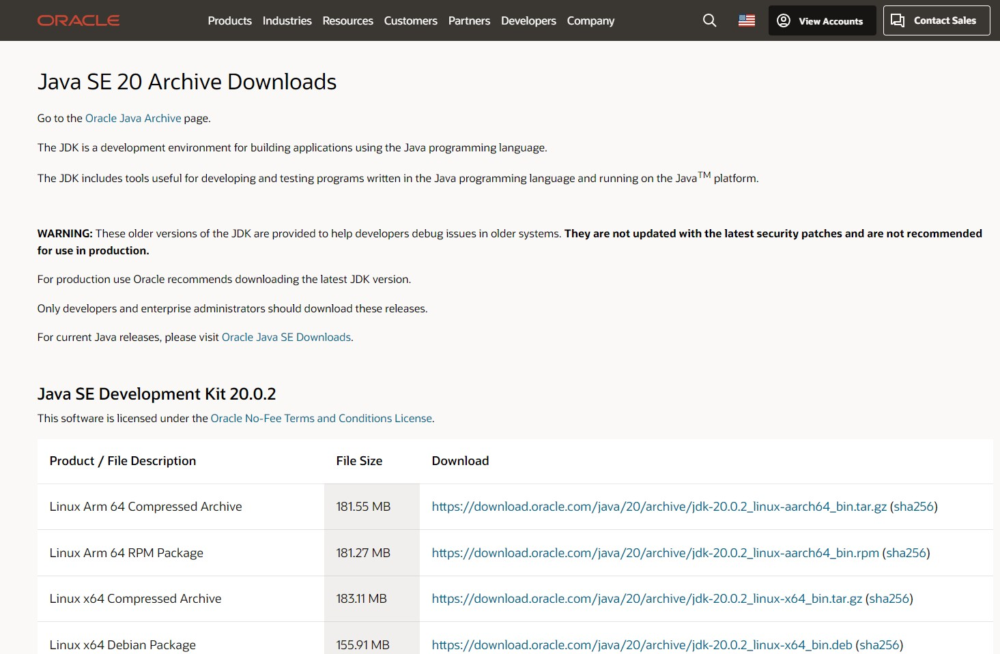
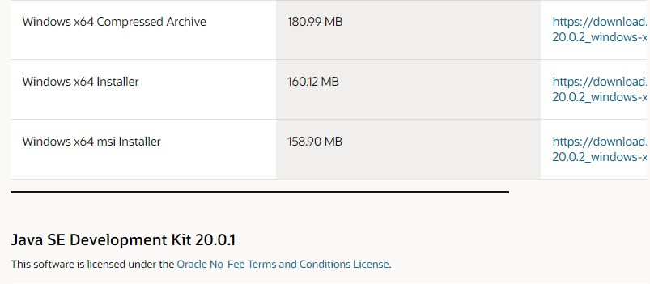

# Java20のインストール

Java SE（Java Standard Edition）は、Javaプラットフォームの標準エディションであり、Javaプログラミング言語の基本的な機能やライブラリが含まれています。Java SEは、デスクトップ、サーバー、組み込みシステムなど、さまざまな環境でJavaアプリケーションを開発および実行するための基盤となる機能を提供します。Java SEには、コアとなるJava言語仕様、Java仮想マシン（JVM）、Javaクラスライブラリなどが含まれています。

## インストーラーをダウンロード

[Java20ダウンロードページ](https://www.oracle.com/java/technologies/javase/jdk20-archive-downloads.html)

上記のリンクへアクセスし、表示されるインストーラーの中で、Windows x64 Installerを探し、右側にあるリンクをクリックしてください。自動でダウンロードが始まります。

一番上にあるからと言ってLinuxのインストーラーを選んでもセットアップされません。

わけわかんなくて焦ってる人のために画像でダウンロード手順を説明します。

まず、サイトにアクセスするとこのような状態だと思います。

上の方はLinuxのインストーラーなので、下にスクロールしていきます。

スクロールしていくと、今回使う20.0.2のひとつ前のバージョンである20.0.1のインストーラーのダウンロード場所が出てきます。

その上にあるWindows x64 Installerが今回使用するものです。右側にあるリンクをクリックし、ダウンロードしてください。

