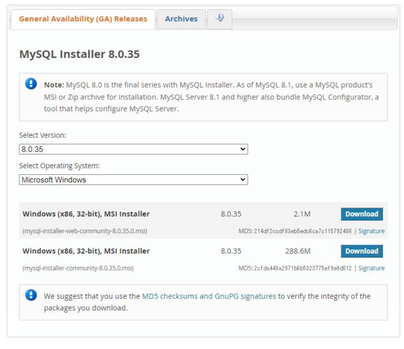
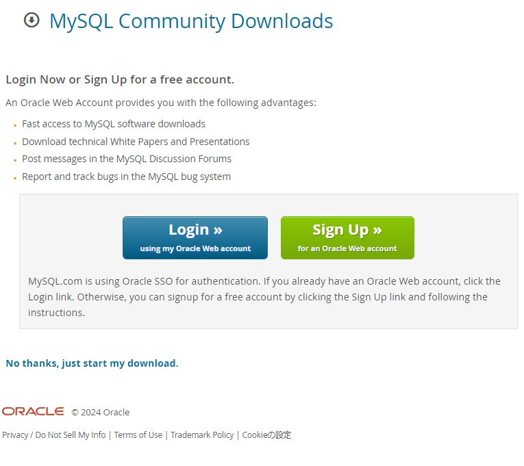
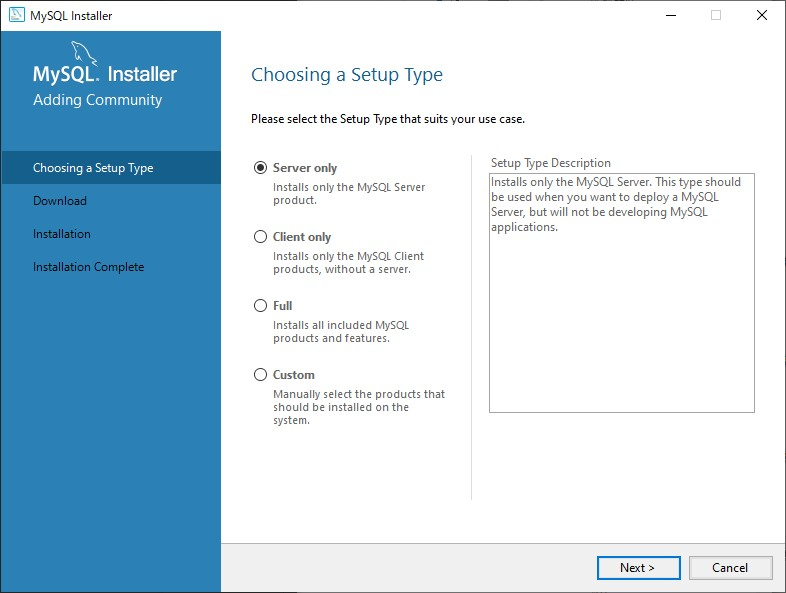

# MySQL Workbenchのインストール

MySQL Workbenchはデータベース問い合わせ言語である`SQL`を用いた管理システムの一つで、現在はオラクル社が管理しています。

YoutubeやTwitterなどの大規模サービスでも利用されているソフトウェアです。

## インストーラーをダウンロード

### MySQL Workbench Installer 8.0.35

[MySQL Workbench公式サイト](https://dev.mysql.com/downloads/windows/installer/8.0.html)にアクセスし、表示されるインストーラーのバージョンなどを確認し、インストーラーをダウンロードしてください。

:::info 今回利用するバージョンについて
ver8.0.35
OS:Microsoft Windows
インストーラーが2つ存在していますが下のインストーラーの方を選んでください。
:::

そうするとこのようにOracleのアカウントでログインするかサインアップさせようとするページへ遷移します。Oracleのアカウントがなくてもインストーラーをダウンロードすることができるので、下の`No thanks,just start my download`を選択してください。

## MySQL Workbenchをセットアップ

ダウンロードフォルダにある`mysql-installer-community-8.0.35.0.msi`を起動してください。そうするとMySQL Installerが開きます。

### タイプ設定をする

インストーラーが起動するとこのようなウィンドウが開きます。`Choosing a Setup Type`を**Full**に切り替えてください。

### Installationの実行

インストールされるパッケージは以下の通り

- MySQL Server 8.0.35
- MySQL Workbench 8.0.34
- MySQL Shell 8.0.35
- MySQL Router 8.0.35
- MySQL Documentation 8.0.35
- Samples and Examples 8.0.35

タイプ設定の時に**Full**を指定していないとこれがすべてインストールされません。

以上のパッケージのインストールがスケジュールされていることを確認し、**Execute**をクリックしてインストールしてください。

:::warning
インストールが失敗してしまい、インストールが中断されて次へ進めなくなってしまう事例があります。その場合左側に表示されるアイコンをクリックしたら再度インストールの試行ができたと思います。
:::

:::danger
インストールが終わった後、Nextボタンを連打すると、元々Nextボタンがあったはずの場所にCancelボタンが出現し、MySQL Serverのセットアップがキャンセルされてしまいます。MySQL Serverのセットアップがされていないと動きません。
:::

