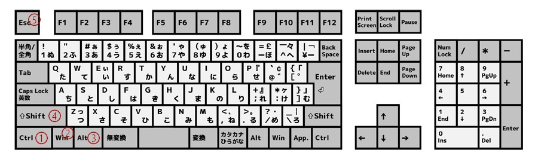

# ショートカットとは

ctrlキーなどのキーとほかのキーを同時に押すと便利な機能を簡単に使うことができるキーなどのキーとほかのキーを同時に押すと便利な機能を簡単に使うことができる。

## やり方

ctrlやshift、alt、windwosキーを先に押してからアルファベットキーを押す。
このキーたちを押しながらアルファベットキーを押す。
アルファベットキーを押したら全て離す。
近くのキーは同じ手で押す。
例ctrl+alt+delの場合:ctrlとaltを左手で押して右手でdelを押す。

## キーについて

| キー | 備考 | 場所 |
| - | - | - |
| ctrl | コントロールキー。単体では押しても特に何も起こらない。 | ① |
| win | windowsキー。押すとwindowsのあれが出てくる。 | ② |
| alt | スペースキーの近く。筆者は英語配列なのでスペースキーのとなり。 | ③ |
| shift | 単体では何も起こらない。押しながらアルファベットを打つと大文字になる。 | ④ |
| esc | エスケープキー。動作のキャンセルなど。 | ⑤ |

## よく使うショートカットキー

| ショートカット | 何ができる |
| - | - |
| ctrl+c ctrl+v | コピーとペースト |
| ctrl+s | 保存 |
| ctrl+z ctrl+y | 元に戻す 。やり直す。間違って消した場合は落ち着いて一度だけctrl+zを押す。その元に戻した操作をさらに戻したい場合はctrl+yを押す。 |
| ctrl+a | すべて選択。 |
| ctrl+x | 切り取り |
| ctrl+tab | ブラウザで隣のタブに移動 |
| ctrl+shift+tab | ブラウザで左隣のタブに移動 |
| ctrl+t | 新規タブ |
| ctrl+shift+esc | タスクマネージャー |
| ctrl+shift+t | ブラウザで閉じたタブを開きなおす |
| ctrl+alt+delete | セキュリティオプション |
| alt+tab | タブの切り替え超絶便利 |
| win+l | ロック画面にする。離席する際便利 |
| alt+f4 | アプリケーションを閉じる。間違っても何かを作っているときやゲーム中に押さないほうがいい。デスクトップ画面で使ってエンターキーを押せばシャットダウン |
| win+x→u→u | シャットダウン。筆者はこれを使っている最後のアルファベットによってオプションが変わる。r→再起動u→シャットダウンs→スリープi→サインアウト |
| shift+win+s | 切り取り&スケッチスクリーンショット自動的にクリップボードに保存されるのでctrl+vで張り付けられる。通知をクリックしてctrl+sで保存できる。 |
| prtsc | 全画面スクリーンショットデュアルモニター以上でやるとすべて取られるのでその場合切り取り&スケッチがおすすめ |
| shift+caps | capslockを切り替えるただし英字配列の場合shiftは不要 |
| win+r | ファイル名を指定して実行 | 