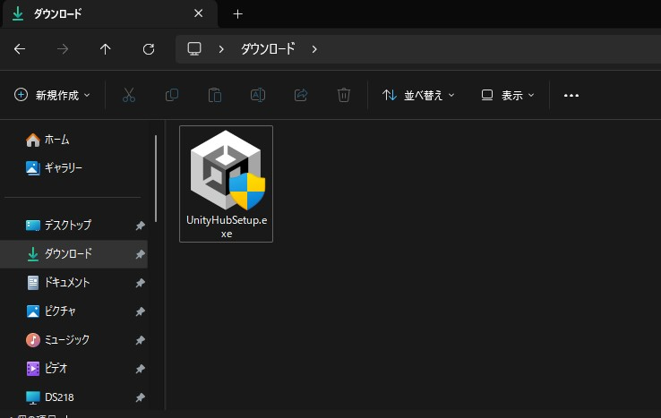

# Unity Hubのセットアップ

Unity HubはUnityのバージョン管理やプロジェクト管理を行うためのアプリケーションです。

Unityのバージョンアップ・ダウンやモジュールの追加・削除が簡単に行うことが出来ます。

## インストーラーをダウンロードする

[UnityHub公式サイト](https://unity.com/ja/download)にアクセスし、`Windows用ダウンロード`と書かれたボタンをクリックします。

:::info Mac版、Linux版をダウンロードしたい人
Windows以外の人は少し下にスクロールしたところの「1.1. Unity Hub をダウンロード」というところにリンクがあります。
:::

## インストーラーを起動

エクスプローラーを起動し、ダウンロードフォルダにアクセスすると、先ほどダウンロードしたインストーラーが保存されています。

アイコンをダブルクリックしてインストーラーを起動しましょう。

※デフォルトではダウンロードしたファイルはダウンロードフォルダに保存されます。

:::warning 学校配布のタブレットPCにインストールしたい人
学校支給のタブレットPCにインストールしようとすると、管理者権限が必要となりインストーラーが起動できません。
担当の先生に確認してインストール出来るようにしましょう。
:::

