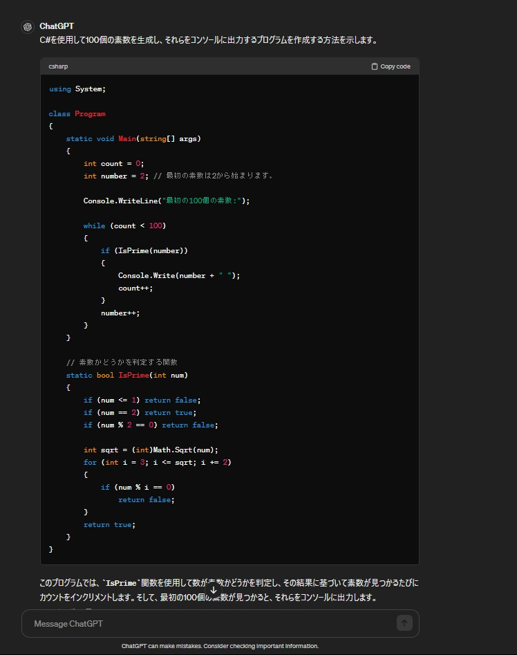

# ChatGPT
chatgptを使って問題を解決する方法について説明します。

## エラーが起きた時

まずはエラーメッセージをchatgptにぶち込みます。

するとgpt君がエラーの詳細をしゃべってくれマス。

そこからコードを書き換えるもよし、コードがわからずgpt君を再度頼るのもよし。

gpt君だけだとわからないこともあるのできちんと自分でも考えましょう。

## コード

エラーの詳細表示だけでなく、gpt君は改善したコードや新たなコードも示してくれます。

させたい動きや働きを言うだけでも、コードを提示してくれるのでプログラミング初心者には心強い味方です。

ただ、gpt君も完ぺきではないのでエラーが出る時もあります。

その時は先ほども言いましたが自分でも考えましょう。

chatgtを使ったコード生成の様子。

<!-- UnityHubIns -->

コードが生成されているのが分かりますね。

[https://chat.openai.com](https://chat.openai.com)

cahatgptのリンクを貼っておきます。

AIをうまく活用して自分の力にしましょう！！