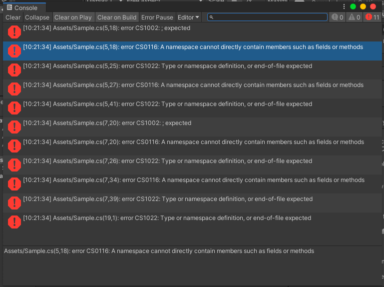
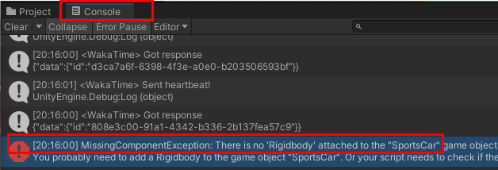
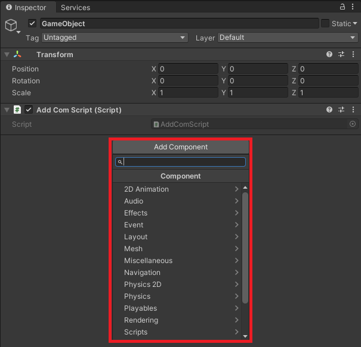

# エラーの原因
エラーの見方を解説します

## エラーログ
<!-- UnityHubInsの画像未変更 -->
赤い三角のメッセージがエラーログと呼ばれるものです
ここに、タイムスタンプ、エラー名称、エラー概要が表示されています。
タップするとエラーがあるスクリプトを表示できるので参考にしましょう。
google翻訳や検索して参考記事を見つけるなどいろいろ解決方法があります。

## 初心者が沼るとこ
MissingComponentExecption:」というエラーです。
恐らくPlayerを動かしたいときに一番よく出ます。

<!-- エラーメッセージ画像未変更 -->

この場合スクリプトに問題がない場合が多く、躓きやすいです。
エラーの名称は「Missing＝ない」　「Component＝コンポーネント」　「Execption＝例外」という意味。

この原因はオブジェクトにRigidbodyのコンポーネントがついていないからです
「Inspecter」でRigidbodyのコンポーネントがないはずなので追加しましょう。

<!-- コンポーネント未変更 -->
「Add Component」から「Rigidbody」をコンポーネントのオブジェクトに追加すると、エラーは解消されるはずです

## C#スクリプト名とクラス名の不一致によるエラー
C#スクリプトファイル名とクラス名は完全に一致させること！

大文字小文字も統一しないとエラーがでます。気をつけましょう。