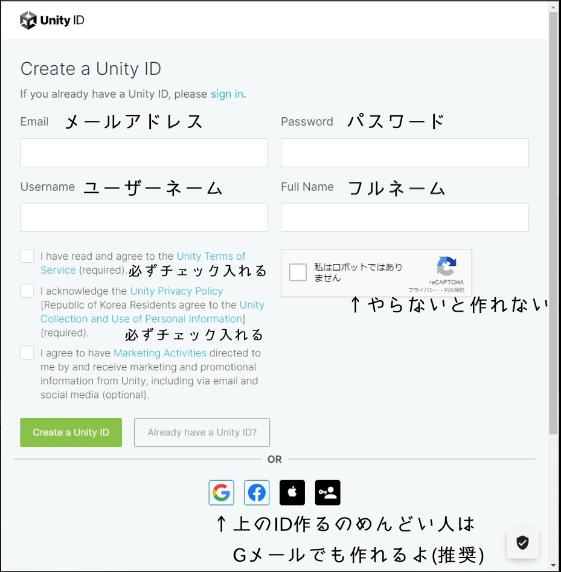
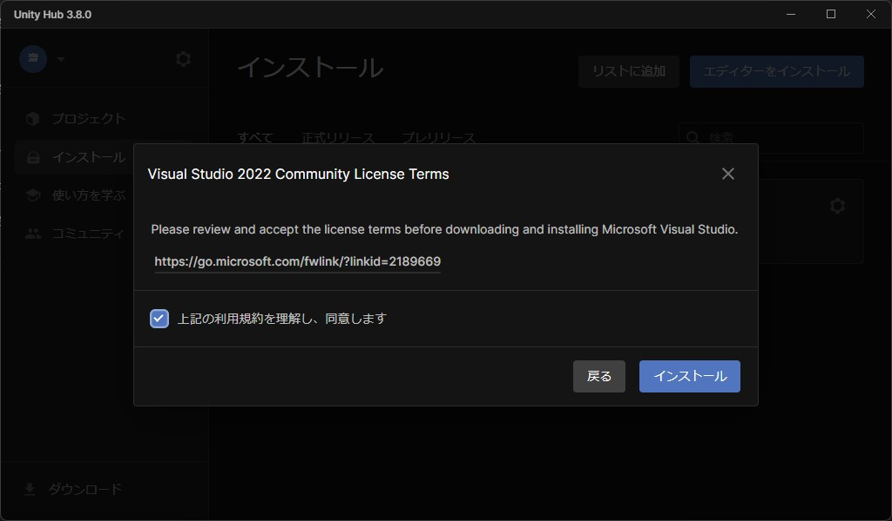

# Unityのセットアップ

[前のページ](./setup-unityhub)でインストールしたUnity HubからUnityをインストールする手順を解説します。

## Unityのアカウントを作る

UnityHubを起動すると最初はこのような画面で表示されます。

`Sign in`ボタンの下にある`Create account`をクリックしてください。

既にアカウントがある人は`Sign in`を選んで[「Unityのエディタをインストールする」](#Unityのエディタをインストールする)に飛んでください。

## UnityIDを作る

Email・Password・Username・FullNameをそれぞれ入力しましょう。

チェックボックスは3つあるうちの上から2つにチェックを入れましょう。

reCAPTCHAのチェックボックスもチェックしましょう。

GoogleやFacebookのアカウントがある人は、画面下にあるボタンから各サービスを使ってアカウントを作成することが出来ます。

:::info UsernameとFullNameの違い
UsernameはUnityコミュニティで表示される名前です。

FullNameはメール受信時に表示される名前です。
:::

## エディタをインストールする

UnityHubの左側メニューから`インストール`をクリックしてください。

次に右上の`エディターをインストール`というボタンをクリックしてください。

色々なバージョンがありますが、特に指定が無ければ**推奨バージョン**をインストールしましょう。

`インストール`をクリックするとモジュールの追加画面に遷移します。

ビルド先のプラットフォーム(WindowsやAndroid等)に合わせて必要なモジュールにチェックを入れましょう。

言語パックの日本語を追加することでエディターが日本語表示になりますので必要な人はチェックを入れましょう。

:::note 
例えばAndroidアプリを作る場合は「Android Build Support」にチェックを入れましょう。
:::

最後に利用規約の同意が求められるので、チェックを入れて`インストール`ボタンをクリックしましょう。

これでUnityエディターのインストールが開始されます。
