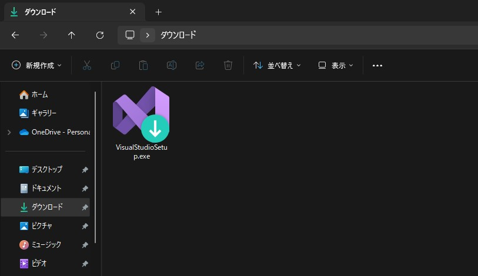

# VisualStudioのセットアップ

VisualStudioはマイクロソフトが開発・販売している統合開発環境で、Unityの標準のエディタです。

## インストーラーをダウンロード

[VisualStudio公式サイト](https://visualstudio.microsoft.com/ja/)にアクセスし、少し下にスクロールしたところにある`Visual Studioのダウンロード`と書かれたボタンをクリックします。

ドロップダウンリストが出てくるので`Community2022`を選んでください。

そうするとインストーラーがダウンロードされます。

## インストーラーを起動

エクスプローラーを起動し、ダウンロードフォルダにアクセスすると、先ほどダウンロードしたインストーラーが保存されています。

アイコンをダブルクリックしてインストーラーを起動しましょう。

※デフォルトではダウンロードしたファイルはダウンロードフォルダに保存されます。

:::warning 学校支給のタブレットPCにインストールしたい人
学校支給のタブレットPCにインストールしようとすると、管理者権限が必要となりインストーラーが起動できません。
担当の先生に確認してインストール出来るようにしましょう。
:::

## インストールする

### VisualStudioインストーラーをインストール

インストーラーを起動させるとこのような画面が出てきます。

そのまま続行をクリックしてください。

そうするとVisualStudioをインストールするためののインストーラーが起動するのでしばらく待ってください。

### Unity開発用モジュールのインストール

モジュールをインストールする画面が出てきます。

下にスクロールして、`Unityによるゲーム開発`と書いてあるモジュールを選択して右下にある`インストール`をクリックします。

後はインストールが完了するまで待つだけです。
